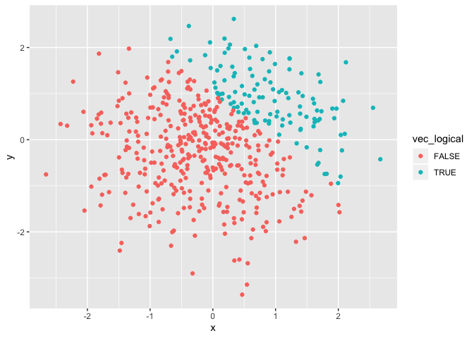
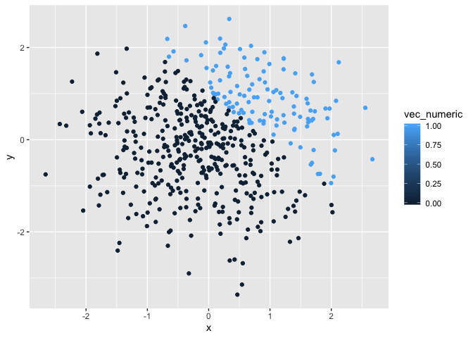
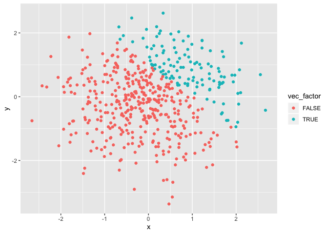

|                                   |
| :-------------------------------- |
| title: “p8105\_hw1\_hmb2161”      |
| author: Hannah Bowlin             |
| output: github\_document: default |

# Problem 0.1:

  - Set up a public GitHub repo and local R project: p8105\_hw1\_hmb2161
    (github link: <https://github.com/hmbowlin/p8105_hw1_hmb2161>)
  - Create a single .rmd file named p8105\_hw1\_hmb2161.rmd (in use)
    that goes to github document (linked and the output github has been
    changed from html above) -Knit document to ensure work is
    reproducible

# Problem 0.2:

  - Ensure solutions are correctly edited and styled based on the
    guidelines in Building Blocks.

# Problem 1:

  - I created a code chunk to answer Problem 1 of the HW1. This problem
    intends to look at variable types (numeric, character, and factor)
    and basic coercion.

**Part I: Creating dataframe for different vectors**

``` r
##I set the working library at tidyverse.
library(tidyverse)
```

    ## ── Attaching packages ────────────────────────────────────────────────── tidyverse 1.2.1 ──

    ## ✔ ggplot2 3.2.1     ✔ purrr   0.3.2
    ## ✔ tibble  2.1.3     ✔ dplyr   0.8.3
    ## ✔ tidyr   0.8.3     ✔ stringr 1.4.0
    ## ✔ readr   1.3.1     ✔ forcats 0.4.0

    ## ── Conflicts ───────────────────────────────────────────────────── tidyverse_conflicts() ──
    ## ✖ dplyr::filter() masks stats::filter()
    ## ✖ dplyr::lag()    masks stats::lag()

``` r
## I set the seed to ensure I get the same numbers each time I run this code.
set.seed(100)

## I created a data frame with a random sample of size 8 from the standard normal distribution, a logical vector showing if the elements in the sample are greater than zero (it will return "false" if it doesn't satisfy this condition), a character vector that is 8 elements long with three different factors apple, pear, and banana.
sample_number = rnorm(n = 8)
vec_logical = sample_number > 0
vec_character = character(length = 8)
vec_factor = factor(c("apple", "banana", "pear", "banana", "pear", "apple", "apple", "pear"))

## I will now take the mean of each variable in my data frame. 
mean(sample_number)
```

    ## [1] 0.1256937

``` r
mean(vec_logical)
```

    ## [1] 0.625

``` r
mean(vec_character)
```

    ## Warning in mean.default(vec_character): argument is not numeric or logical:
    ## returning NA

    ## [1] NA

``` r
mean(vec_factor)
```

    ## Warning in mean.default(vec_factor): argument is not numeric or logical:
    ## returning NA

    ## [1] NA

  - The mean for (sample\_number) is 0.1256937. As sample\_number is a
    random sample of numbers and I am able to take the mean of these
    numbers
  - The mean for (vec\_logical) is 0.625. As vec\_logical is based on
    sample\_number, it will run when its condition is satisfied.
    vec\_logical represents the mean of sample\_number when
    sample\_number’s elements are greater than 0.
  - The mean for vec\_character is not possible as R views it as
    non-numeric text.You could store numbers in a character vector, but
    R would not view them as numbers, but as numbers stored as text.
  - The mean for vec\_factor is not possible as R views it as
    non-numeric characters that are grouped into factor levels.

**Part II: Converting variables between character and numeric format**

``` r
as.numeric(vec_logical)
```

    ## [1] 0 1 0 1 1 1 0 1

``` r
as.numeric(vec_character)
```

    ## [1] NA NA NA NA NA NA NA NA

``` r
as.numeric(vec_factor)
```

    ## [1] 1 2 3 2 3 1 1 3

  - I created a new code chunk to work on the command as.numeric. I
    changed the logical, character, and factor vectors to numeric. The
    sample\_number vector was already numeric and doesn’t need to be
    changed.

  - The command made these character and factor vectors numeric so the
    logical vector now stores true and false as 0 and 1, the character
    vector stores the values as 8 numbers, and when I entered in factor
    levels it saves as 1, 2, 3, not apple, banana, pear.

  - This means that you can change character vectors into numeric form
    with the command as.numeric. I now know that I couldn’t take the
    mean of these variables because they weren’t stored as numbers, they
    were stored as text.

**Part III: Manipulation of vectors and formats**

``` r
#Changed vec_logical to numeric and multiplied it by random sample
as.numeric(vec_logical) * sample_number 
```

    ## [1] 0.0000000 0.1315312 0.0000000 0.8867848 0.1169713 0.3186301 0.0000000
    ## [8] 0.7145327

``` r
#Changed vec_logical to factor and multiplied it by the random sample
as.factor(vec_logical) * sample_number
```

    ## Warning in Ops.factor(as.factor(vec_logical), sample_number): '*' not
    ## meaningful for factors

    ## [1] NA NA NA NA NA NA NA NA

``` r
#Changed vec_logical to factor and converted result to numeric and then multipled it by the random sample
as.numeric(as.factor(vec_logical)) * sample_number
```

    ## [1] -0.50219235  0.26306233 -0.07891709  1.77356962  0.23394254  0.63726018
    ## [7] -0.58179068  1.42906542

  - When I changed the logical vector to factor, it didn’t work as it is
    saved as a factor, not as numeric. When I changed the logical vector
    to a factor and changed that entire result to numeric, then the
    multiplication worked.

# Problem 2:

**Part I: Create data frame for random samples and different vectors**

``` r
#Set the seed so that I get the same result every time 
set.seed(1000)

#Create dataframe 
probtwo_df = tibble(
  x = rnorm(n = 500),
  y = rnorm(n = 500),
  vec_logical = (x + y) > 1,
  vec_numeric = as.numeric(vec_logical),
  vec_factor = as.factor(vec_logical)
) 
```

  - The vector above shows the values of x + y when they are greater
    than 1 (when the logical vector is true). I then coerced this
    logical vector to be take on numeric values and coerced that result
    to factor into levels.
  - The size of the dataset is 500 rows and 5 columns
  - The mean of the dataset is 0.0085449, the median is 0.0065174, and
    the standard deviation is 0.9390666
  - The proportion of cases for which x + y \>1 is 0.625

**Part II: Plotting dataframe**

``` r
ggplot(probtwo_df, aes(x = x, y = y, color = vec_logical)) +
  geom_point()
```

<!-- -->

``` r
ggplot(probtwo_df, aes(x = x, y = y, color = vec_numeric)) +
  geom_point()
```

<!-- -->

``` r
ggplot(probtwo_df, aes(x = x, y = y, color = vec_factor)) +
  geom_point()
```

<!-- -->
